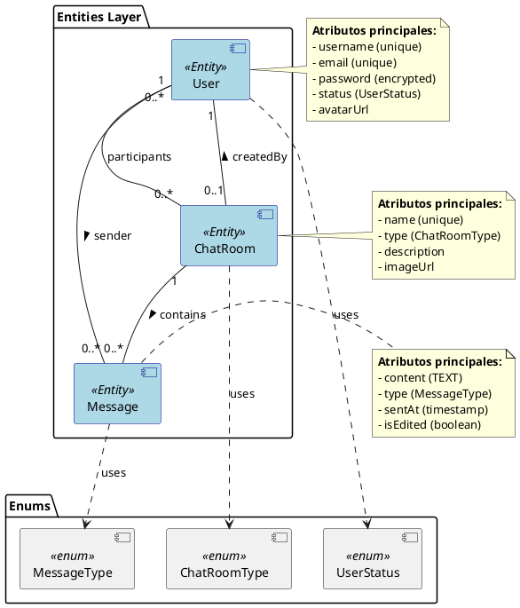
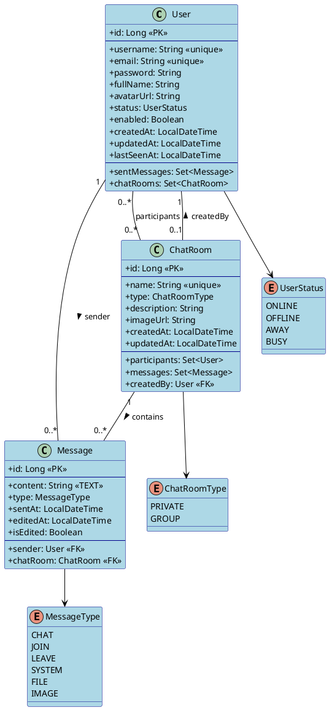
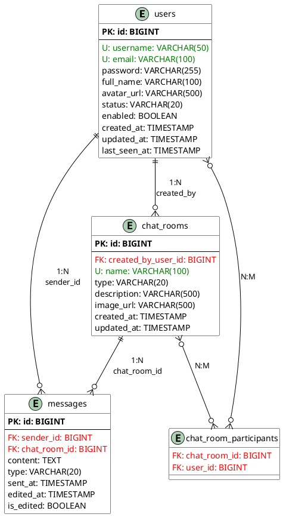

# Entidades JPA

## Descripción General

El sistema de chat está compuesto por tres entidades principales que modelan usuarios, mensajes y salas de chat. Estas entidades se relacionan entre sí para formar la base de datos del sistema.

## Diagrama de Entidades



## Entidades Principales

### User

Representa un usuario en el sistema de chat. Almacena información de autenticación, perfil y estado de conexión.

**Relaciones:**
- One-to-Many con `Message` (mensajes enviados)
- Many-to-Many con `ChatRoom` (salas de chat en las que participa)
- One-to-Many con `ChatRoom` (salas creadas)

**Estados posibles (UserStatus):**
- `ONLINE`: Usuario conectado y activo
- `OFFLINE`: Usuario desconectado
- `AWAY`: Usuario conectado pero ausente
- `BUSY`: Usuario conectado pero ocupado

### Message

Representa un mensaje en una sala de chat.

**Relaciones:**
- Many-to-One con `User` (remitente del mensaje)
- Many-to-One con `ChatRoom` (sala donde se envió)

**Tipos de mensaje (MessageType):**
- `CHAT`: Mensaje de chat normal
- `JOIN`: Usuario se unió a la sala
- `LEAVE`: Usuario abandonó la sala
- `SYSTEM`: Mensaje generado por el sistema
- `FILE`: Mensaje con archivo adjunto
- `IMAGE`: Mensaje con imagen

### ChatRoom

Representa una sala de chat (privada o grupal).

**Relaciones:**
- Many-to-Many con `User` (participantes)
- One-to-Many con `Message` (mensajes de la sala)
- Many-to-One con `User` (creador de la sala)

**Tipos de sala (ChatRoomType):**
- `PRIVATE`: Chat entre dos usuarios exactamente
- `GROUP`: Chat con múltiples participantes (3+)

## Diagrama Detallado



## Atributos Detallados

### User

| Atributo | Tipo | Constraints | Descripción |
|----------|------|-------------|-------------|
| id | Long | PK, Auto-increment | Identificador único |
| username | String(50) | Unique, Not Null | Nombre de usuario |
| email | String(100) | Unique, Not Null | Correo electrónico |
| password | String | Not Null | Contraseña encriptada |
| fullName | String(100) | Nullable | Nombre completo |
| avatarUrl | String(500) | Nullable | URL de imagen de perfil |
| status | UserStatus | Not Null | Estado de conexión (default: OFFLINE) |
| enabled | Boolean | Not Null | Cuenta habilitada (default: true) |
| createdAt | LocalDateTime | Not Null, Immutable | Fecha de creación |
| updatedAt | LocalDateTime | Auto-update | Fecha de última actualización |
| lastSeenAt | LocalDateTime | Nullable | Última conexión |

### Message

| Atributo | Tipo | Constraints | Descripción |
|----------|------|-------------|-------------|
| id | Long | PK, Auto-increment | Identificador único |
| content | String | Not Null, TEXT | Contenido del mensaje |
| type | MessageType | Not Null | Tipo de mensaje (default: CHAT) |
| sentAt | LocalDateTime | Not Null, Immutable | Fecha de envío |
| editedAt | LocalDateTime | Nullable | Fecha de última edición |
| isEdited | Boolean | Not Null | Indica si fue editado (default: false) |
| sender | User | FK, Not Null | Remitente del mensaje |
| chatRoom | ChatRoom | FK, Not Null | Sala donde se envió |

### ChatRoom

| Atributo | Tipo | Constraints | Descripción |
|----------|------|-------------|-------------|
| id | Long | PK, Auto-increment | Identificador único |
| name | String(100) | Unique, Not Null | Nombre de la sala |
| type | ChatRoomType | Not Null | Tipo de sala (default: PRIVATE) |
| description | String(500) | Nullable | Descripción de la sala |
| imageUrl | String(500) | Nullable | URL de imagen de la sala |
| createdAt | LocalDateTime | Not Null, Immutable | Fecha de creación |
| updatedAt | LocalDateTime | Auto-update | Fecha de última actualización |
| participants | Set\<User\> | Many-to-Many | Usuarios participantes |
| messages | Set\<Message\> | One-to-Many | Mensajes de la sala |
| createdBy | User | FK, Nullable | Creador de la sala |

## Esquema de Base de Datos



## Reglas de Negocio

### Salas Privadas
- Exactamente 2 participantes
- Nombre generado automáticamente
- Sin descripción ni imagen personalizadas

### Salas Grupales
- 3 o más participantes
- Nombre personalizable y único
- Pueden tener descripción e imagen
- Tienen un creador con permisos especiales

### Mensajes
- Pueden ser editados (campo `isEdited` e `editedAt`)
- Soportan múltiples tipos de contenido
- Timestamp de creación inmutable

### Usuarios
- Username y email deben ser únicos
- Contraseña encriptada (nunca expuesta en API)
- Estado de conexión actualizable en tiempo real

## Flujo de Datos

```plantuml
@startuml

title Interacciones entre Entidades

actor "Usuario 1" as user1
actor "Usuario 2" as user2

database "Database" as db {
    storage "users" as users_table
    storage "chat_rooms" as rooms_table
    storage "messages" as messages_table
    storage "chat_room_participants" as participants_table
}

group Crear Sala Privada
    user1 -> users_table : 1. Authenticate
    user1 -> rooms_table : 2. Create ChatRoom (type=PRIVATE)
    rooms_table -> participants_table : 3. Add participants
    note right
        Exactamente 2 participantes
    end note
end

group Enviar Mensaje
    user1 -> users_table : 4. Authenticate
    user1 -> messages_table : 5. Create Message
    messages_table --> rooms_table : 6. Associate with ChatRoom
    user2 <-- messages_table : 7. Notify via WebSocket
end

group Actualizar Estado
    user1 -> users_table : 8. Update status (ONLINE → AWAY)
    users_table --> user2 : 9. Broadcast status change
end

@enduml
```

## Cardinalidades

### User ↔ Message
- **1 User** puede enviar **muchos Messages** (0..*)
- **1 Message** pertenece a **1 User** (sender)

### User ↔ ChatRoom (participants)
- **1 User** puede participar en **muchas ChatRooms** (0..*)
- **1 ChatRoom** puede tener **muchos Users** como participantes (0..*)
- **Tabla intermedia:** `chat_room_participants`

### User ↔ ChatRoom (creator)
- **1 User** puede crear **muchas ChatRooms** (0..*)
- **1 ChatRoom** es creada por **0..1 User** (puede ser null para salas privadas)

### ChatRoom ↔ Message
- **1 ChatRoom** contiene **muchos Messages** (0..*)
- **1 Message** pertenece a **1 ChatRoom**

## Configuración JPA

### Anotaciones Principales

```java
@Entity
@Table(name = "users")
public class User {
    @Id
    @GeneratedValue(strategy = GenerationType.IDENTITY)
    private Long id;
    
    @Column(unique = true, nullable = false)
    private String username;
    
    @Enumerated(EnumType.STRING)
    private UserStatus status;
    
    @OneToMany(mappedBy = "sender", cascade = CascadeType.ALL)
    private Set<Message> sentMessages;
}
```

### Estrategias de Cascade

- **User → Message**: CASCADE ALL, ORPHAN REMOVAL
- **ChatRoom → Message**: CASCADE ALL, ORPHAN REMOVAL

### Fetch Strategies

- **Message.sender**: LAZY
- **Message.chatRoom**: LAZY
